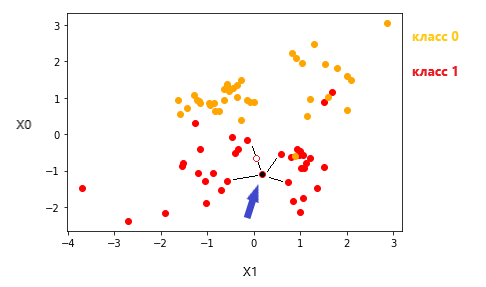

## SMOTE:
(Synthetic Minority Over-sampling Technique)

## Алгоритм перебалансировки наблюдений по классам

Алгоритм предназначен для перебалансировки наблюдений с целью обеспечения баланса классов по целевой переменной (в задаче классификации). На выходе получается одинаковое число наблюдений по каждому классу. Количество наблюдений ничем не ограничивается, т.е. можно увеличивать число наблюдений и по максимальному классу. Таким образом перебалансировка увеличивает размер выборки. Для уменьшения объема выборки используют метод Random Sampling.

## Описание алгоритма

Случайно выбирается наблюдение по классу (см. рисунок, стрелка), объём наблюдений которго нужно увеличить. Для него определяются k ближайших наблюдений того же класса. Случайно выбирается одно из них. Новое наблюдение генерируется умножением случайного значения от 0 до 1 на расстояние между каждым признаком этой пары наблюдений (о - новое наблюдение). В дальнейшем сгенерированное наблюдение не используется при поиске k ближайших при создании новых наблюдений.

Таким образом можно создавать наблюдения для малых классов балансируя выборку, а также добавлять наблюдения к наибольшему классу, увеличивая общее число наблюдений.

## Результат

На новых данных метрики возрастут, но не нужно обольщаться потому как это синтетические наблюдения, не имеющие отношение к реальности. Зачем тогда это делать? - Я не знаю. Просто интересный алгоритм, легок в реализации. Попробовал, погравилось.

Ниже результат работы KNN для классификации (три класса), скользящий контроль. Первое значение это начальное число наблюдений, второе - увеличенное число наблюдений. 

original cv score: 0.681 8(\
new data cv score: 0.996 (Wow! I will win this Kaggle!)
